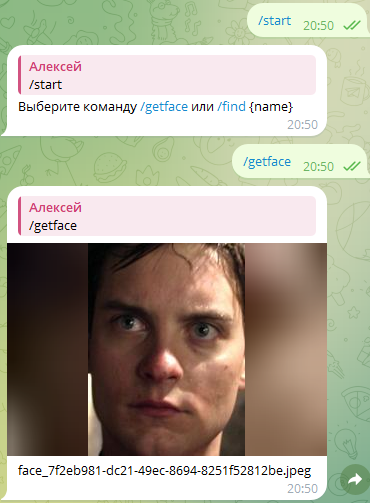
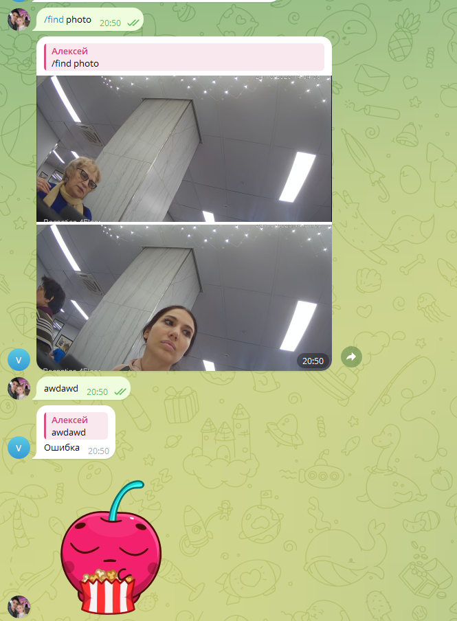
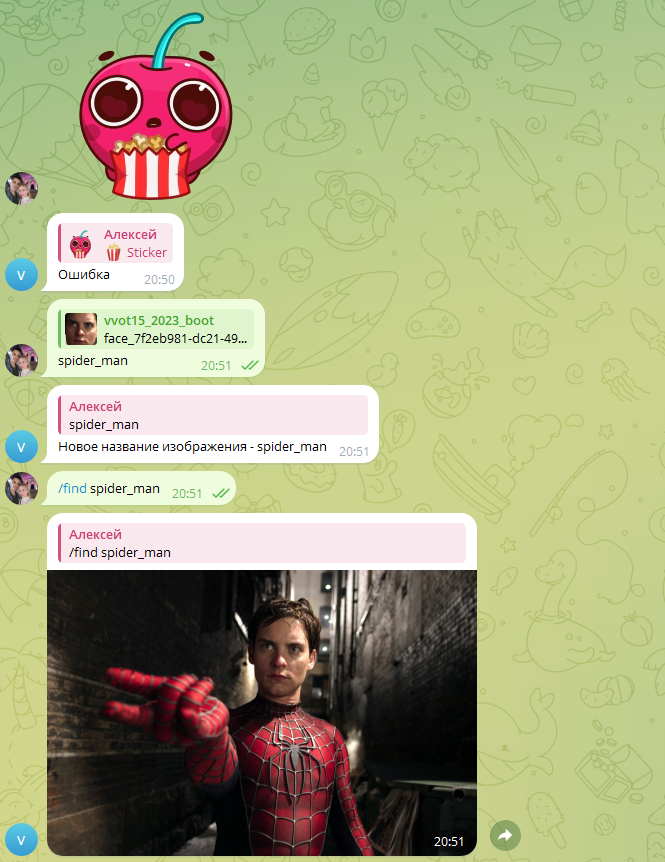

# Задание 1. Обработка фотографий с лицами людей

### Журавлёв Алексей Константинович 11-007.

## Облачные функции

Код для обработчиков находится в папках face-detection, face-cut, tg-boot

## Запуск конфигурации terraform

### Выполнить команды в корне папки с помощью CLI Yandex Cloud

```
1. yc iam service-account create --name <service-name> --folder-name=<folder-name>
2. yc <service-name> <resource> add-access-binding <resource-name>|<resource-id> --role <role-id> --subject serviceAccount:<service-account-id>
3. yc iam key create --service-account-id <service-account-id> --folder-name <folder-name> --output key.json
```

Изменить переменные в файле terraform.tfvars

```
yandex_cloud_id  = <cloud_id> 
yandex_folder_id = <folder_id> 
user             = <vvot_number>
tgkey            = <tg_bot_token>
```

### Выполнить команды

```
terraform init
terraform fmt
terraform validate
terraform plan 
terraform apply 
```

Телеграм бот - https://t.me/vvot15_2023_bot

Подтверждение:




